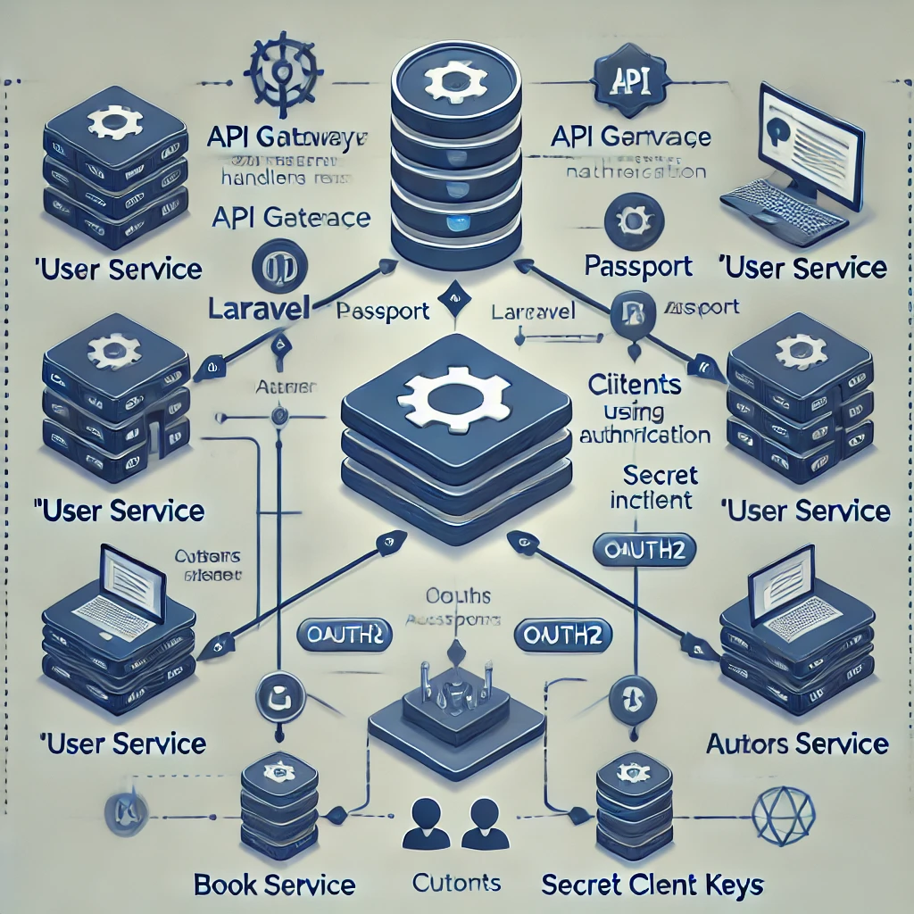

# User service / API Gateway

- [User service / API Gateway](https://github.com/soulaimaneyahya/x1microservices-user-service)
- [Author Service](https://github.com/soulaimaneyahya/x1microservices-author-service)
- [Book service / API Gateway](https://github.com/soulaimaneyahya/x1microservices-book-service)



```sh
composer install
cp .env.example .env
```

Generate key
```sh
php -r "echo 'base64:' . base64_encode(random_bytes(32)) . PHP_EOL;"
```

Set Permissions
```sh
sudo chmod -R 775 storage
```

Run Service
```sh
php -S localhost:8000 -t public
```

PassportServiceProvider
```php
Passport::ignoreMigrations();
```

Generate PHP-Lumen Encryption keys
```sh
php artisan passport:keys
```

DB Seed
```sh
php artisan migrate
php artisan db:seed
php artisan db:seed --class=TruncateOAuthTablesSeeder
php artisan db:seed --class=InsertMigrationsSeeder
```

PHP Lumen Passport
ensure getting `CLIENT_SECRET`, check postman

```sh
// .env

CLIENT_SECRET=your_client_secret
API_GATEWAY_SECRETS=your_client_secret
```

